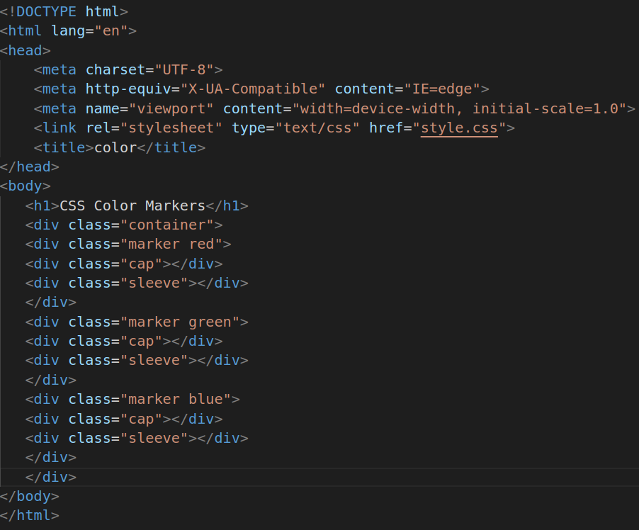
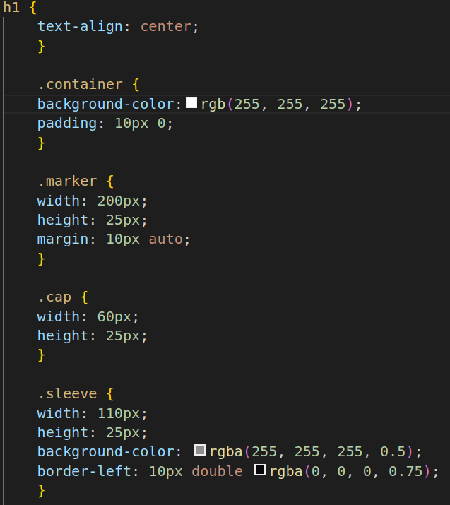
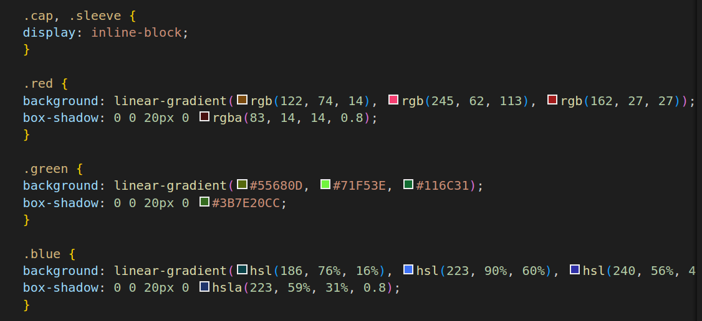

# color maker
1.
* The link element is used to link an external CSS stylesheet named "style.css" to HTML document.
* The h1 which represents the main heading of the page. It's used to display the text "CSS Color Markers" as a prominent title.
* The div element with the class "container." It's used to create a container to group and style the marker elements.
* The div element with the class "marker" and "red." It represents a marker with a red color.
* The div class cap is a child element with the class "cap," representing the cap of the marker.
* The div class sleeve is another child div element with the class "sleeve," representing the sleeve of the marker.
* Similar sets of div elements with different classes ("marker green" and "marker blue") represent markers of different colors (green and blue).

2.
* h1: This is a selector targeting h1 elements in HTML. It's used to style the heading text.
* text-align: center: This property centers the text horizontally within its container.
* container: This selector targets a div element with the class "container." It's used to style the container of the markers.
* background-color: rgb(255, 255, 255): Sets the background color of the container to white.
padding: 10px 0: Adds 10 pixels of padding at the top and bottom of the container.
* marker: This selector targets div elements with the class "marker." It's used to style the marker elements.
* width: 200px: Sets the width of the marker.
* height: 25px: Sets the height of the marker.
* margin: 10px auto;: Centers the marker horizontally with 10 pixels of margin on top and bottom.
* cap: This selector targets div elements with the class "cap," which represents the caps on the markers.
* width: 60px: Sets the width of the cap.
* height: 25px: Sets the height of the cap.
* sleeve: This selector targets div elements with the class "sleeve," which represents the colored sleeves on the markers.
* width: 110px: Sets the width of the sleeve.
* height: 25px: Sets the height of the sleeve.
* background-color: rgba(255, 255, 255, 0.5): Gives the sleeve a semi-transparent white background color.
* border-left: 10px double rgba(0, 0, 0, 0.75): Adds a double black border to the left side of the sleeve.

3.
* cap, .sleeve: This selector groups the ".cap" and ".sleeve" classes to apply certain properties to both elements.
* display: inline-block;: Allows the ".cap" and ".sleeve" elements to be displayed on the same line.
* red, .green, .blue: These selectors target markers with the classes "red," "green," and "blue," respectively. They are used to style the different colored markers.
* background: Applies a linear gradient background color to the markers.
* box-shadow: Adds a shadow effect to the markers, giving them a 3D appearance. The box-shadow property takes four values: horizontal offset, vertical offset, blur radius, and color.

